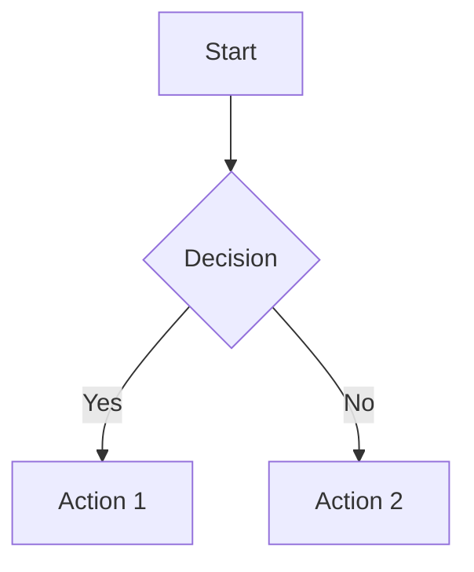
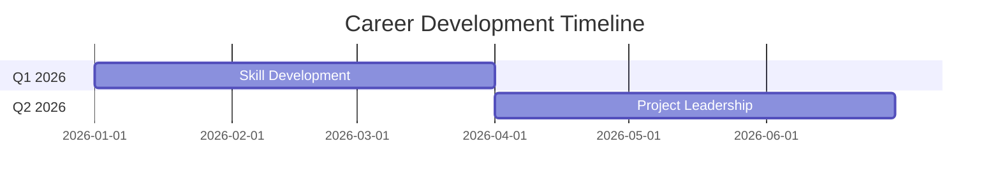

## What I do

Provide comprehensive formatting rules and guidelines for creating and editing notes in the Obsidian vault at `~/Documents/mlambert_uk/`, designed for engineering management, people leadership, and personal knowledge management.

## When to use me

Use this skill whenever you need to:
- Create a new note in the Obsidian vault (`~/Documents/mlambert_uk/`)
- Edit an existing note in the vault
- Format markdown content for Obsidian
- Add frontmatter to notes
- Create WikiLinks between notes

## Language and Style

### British English (REQUIRED)
Always use British English spelling and phrasing:
- **organise** (not organize)
- **colour** (not color)
- **realise** (not realize)
- **behaviour** (not behavior)
- **analyse** (not analyze)
- **centre** (not center)
- **honour** (not honor)
- **favour** (not favor)

### Tone and Writing Style
- **Professional and supportive** - write for leadership clarity and actionability
- **Concise and informative** - every word should earn its place
- **Direct and actionable** - focus on insights and key takeaways
- **Scannable** - use clear structure, headings, and bullet points
- **Link liberally** - create connections between related concepts

## Frontmatter

### General Notes
```yaml
---
tags: [tag1, tag2, tag3]
categories: Primary Category
Created: YYYY-MM-DD HH:mm
---
```

### 1:1 Meeting Notes
```yaml
---
tags: [1-1, meeting]
Date: YYYY-MM-DD
Person: [[Person Name]]
Team: Team Name
---
```

### Performance Review Notes
```yaml
---
tags: [performance, review]
Date: YYYY-MM-DD
Person: [[Person Name]]
Period: YYYY-MM-DD to YYYY-MM-DD
---
```

### Career Development Plans
```yaml
---
tags: [career-development, goals]
Person: [[Person Name]]
Created: YYYY-MM-DD
Review Date: YYYY-MM-DD
---
```

## WikiLinks

### People
Format: `[[Firstname Lastname]]`

Examples:
- `[[Stewart Bowie]]`
- `[[Callum Lowry]]`
- `[[Harry Wilkins]]`

### Dates
Format: `[[YYYY-MM-DD]]` (ISO 8601 format)

Examples:
- `[[2026-01-12]]`
- `[[2025-12-25]]`

**Important:** Use YYYY-MM-DD format, not DD-MM-YYYY

### Concepts and Topics
Format: `[[Concept Name]]`

Examples:
- `[[Conway's Law]]`
- `[[Team Cognitive Load]]`
- `[[Avayler Career Framework]]`

### Projects and Processes
Link to projects and processes with full path when ambiguous:

Examples:
- `[[1 - Projects/AI Adoption Initiative]]`
- `[[C - Resources/3 - Product and Delivery/Sprint Planning]]`

### Aliased Links
When you want different display text:

Format: `[[Actual Note Name|Display Text]]`

Example: `[[6 - Projects/Platform Redesign|platform]]`

## Markdown Structure

### Headings
- Use `##` for main sections (H2)
- Use `###` for subsections (H3)
- Use `####` sparingly for sub-subsections (H4)
- **Never use `#` (H1)** - the note title serves as H1

### Lists
**Bullet points** for:
- Action items
- Key takeaways
- Features or characteristics
- Related concepts

**Numbered lists** for:
- Step-by-step processes
- Ordered priorities
- Sequential information

### Emphasis
- **Bold** (`**text**`) for key terms and important emphasis
- *Italics* (`*text*`) for subtle emphasis or terms being defined
- `Code formatting` for technical terms, commands, file names

### Blockquotes
Use `>` for:
- Important callouts
- Quotes from sources
- Key insights to highlight

## Obsidian Callouts

Use Obsidian's special callout syntax for structured emphasis:

### Information Box
```markdown
>[!info]
>Informational content here
```

### Important Points
```markdown
>[!important]
>Critical information that must not be missed
```

### Action Items
```markdown
>[!todo]
>- [ ] Action item 1
>- [ ] Action item 2
```

### Escalation Warnings
```markdown
>[!warning]
>⚠️ **ESCALATION REQUIRED**
>
>**Concern**: [What you've identified]
>**Why This Needs Attention**: [Reason]
```

### Tips
```markdown
>[!tip]
>Helpful tip or suggestion
```

## Mermaid Diagrams

Use Obsidian's mermaid diagram features for clarity:

### Flowcharts


### Timeline Diagrams (for career progression)


## Vault Structure

The Obsidian vault at `~/Documents/mlambert_uk/` follows a modified PARA structure with numbered and lettered folders:

### Primary Folders
- **`0 - Journal/`** - Daily journal entries
- **`1 - Projects/`** - Active project tracking (single source of truth)
  - `Tasks/` - Project-specific task files (OpenCode-managed)
- **`2 - Areas/`** - Ongoing areas of responsibility
- **`3 - Me/`** - Personal development and reflections
- **`4 - Goals/`** - Goal tracking and planning
- **`5 - People/`** - People notes and relationships
  - `Personal/` - Personal contacts
  - `Work/` - Work colleagues by team
- **`6 - Recipes/`** - Recipe collection
- **`9 - Blog/`** - Blog content
- **`9 - Exodus Universe/`** - Creative writing
- **`A - Avayler/`** - Work-related (Avayler company context)
- **`B - Sources/`** - Reference materials
- **`C - Resources/`** - General resources
- **`C - Resources/2 - People Management/Line Management/Meeting Agendas/`** - 1:1 meeting agendas
  - `2 - People Management/` - People management resources
- **`D - Meeting Notes/`** - Meeting notes archive
  - `Line Management/` - 1:1 meeting notes by person
  - `Interviews/` - Interview assessments
  - `Other/` - Other meetings
- **`E - AI Toolbox/`** - AI-related content
- **`F - Archives/`** - Completed projects and archived content
- **`Z - Meta/`** - Vault metadata
- **`OpenCode/`** - OpenCode-specific files
  - `Memory/` - Session learnings (append-only)
  - `Templates/` - Reusable templates

### Note Placement Guidelines
- **1:1 meetings:** `D - Meeting Notes/Line Management/[Firstname Lastname]/[YYMMDD] - [Name] - 1-1 Agenda.md`
- **Personal records:** `5 - People/Work/[Team]/[Firstname Lastname].md`
- **Interview assessments:** `D - Meeting Notes/Interviews/[Candidate Name]/`
- **Projects:** `1 - Projects/[Project Name].md`
- **Project tasks:** `1 - Projects/Tasks/[project-name].md`
- **Session memories:** `OpenCode/Memory/[descriptive-name].md`

## File Naming

### Use Spaces, Not Underscores
❌ `my_note_title.md`
✅ `My Note Title.md`

### Clear, Descriptive Names
❌ `notes.md`
✅ `Platform Team Sprint 42 Retrospective.md`

### Person-Specific Notes
- **1:1 notes:** `[Firstname Lastname] - 1-1 Notes.md`
- **Career plans:** `[Firstname Lastname] - Career Plan.md`
- **Performance reviews:** `[Firstname Lastname] - Review 2026.md`

## Templates

Check for templates in `OpenCode/Templates/` and `Z - Meta/Templates/` before creating new notes:
- Use consistent structure for common note types
- Templates provide standardised frontmatter and sections

## Vault Location

**Primary vault path:** `~/Documents/mlambert_uk/`

Use this path when referencing or creating files in the vault.

## Examples

### Good 1:1 Meeting Note Structure
```markdown
---
tags: [1-1, meeting]
Date: 2026-01-12
Person: [[Stewart Bowie]]
Team: Integrations
---

# 1:1 Notes - Stewart Bowie

## [[2026-01-12]] - Sprint 42 Check-in

### Check-in
Stewart feeling good about recent integration work. No immediate concerns.

### Outstanding Action Items
- [x] Complete API documentation (completed early!)
- [ ] Review architecture proposals by [[2026-01-20]]

### Current Work
Working on B2B integration project. On track for sprint goals.

### Career Development
Discussed senior developer progression. Reviewing Avayler Career Framework together.

### Action Items
- [ ] **Mark:** Schedule architecture review meeting
- [ ] **Stewart:** Complete architecture proposal review by [[2026-01-20]]

### Next Meeting
[[2026-02-09]]
```

### Good Team Health Note
```markdown
---
tags: [team-health, metrics]
Date: 2026-01-12
Team: Platform Team
---

# Platform Team Health - January 2026

## Key Metrics
- **Velocity:** 42 points (trend: stable)
- **Cycle Time:** 3.2 days (trend: improving)
- **Team Satisfaction:** 7.8/10

## Observations
- Team morale remains high
- Collaboration improving with new pairing approach
- No burnout signals detected

## Action Items
- [ ] Continue monitoring velocity trends
- [ ] Schedule team building activity
```

## Common Mistakes to Avoid

❌ Using American English (organize, color, realize)
❌ Using underscores in file names (my_note.md)
❌ Using DD-MM-YYYY date format instead of YYYY-MM-DD
❌ Missing frontmatter entirely
❌ Not linking to people using WikiLinks
❌ Using H1 (`#`) for section headings
❌ Verbose or fluffy writing without substance
❌ Not using callouts for escalations or important information
❌ Creating duplicate person notes instead of appending to existing ones

## Summary

When working with Engineering Leadership Tools notes:
1. **Always use British English** throughout
2. **Add proper frontmatter** for the note type
3. **Link people liberally** using WikiLinks (`[[Firstname Lastname]]`)
4. **Use clear structure** with headings and lists
5. **Be concise and actionable** - respect the reader's time
6. **Place notes in the correct vault folder**
7. **Use mermaid diagrams** for complex concepts
8. **Use callouts** for escalations and important information
9. **Follow naming conventions** (spaces, not underscores)
10. **Append to person-specific notes** rather than creating new ones
